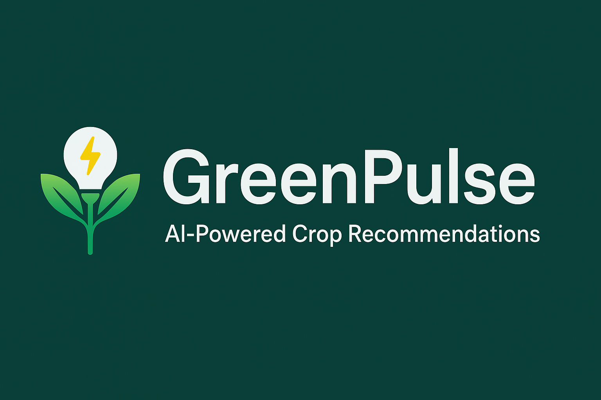
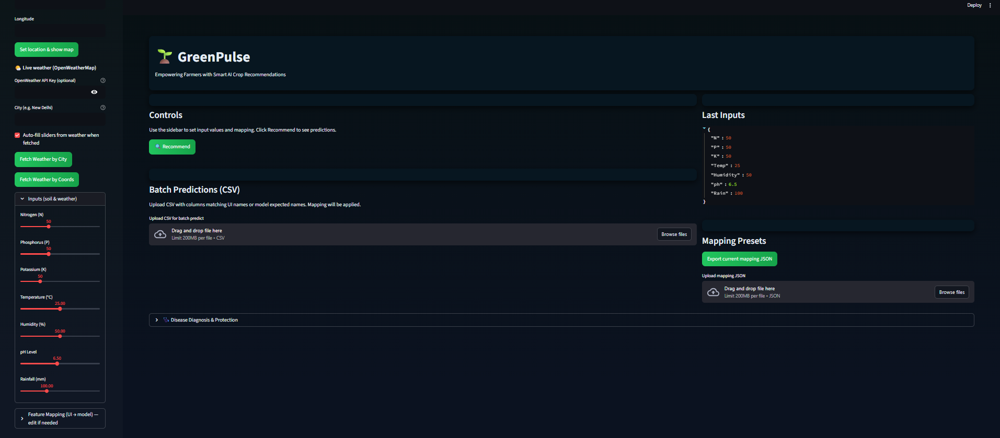
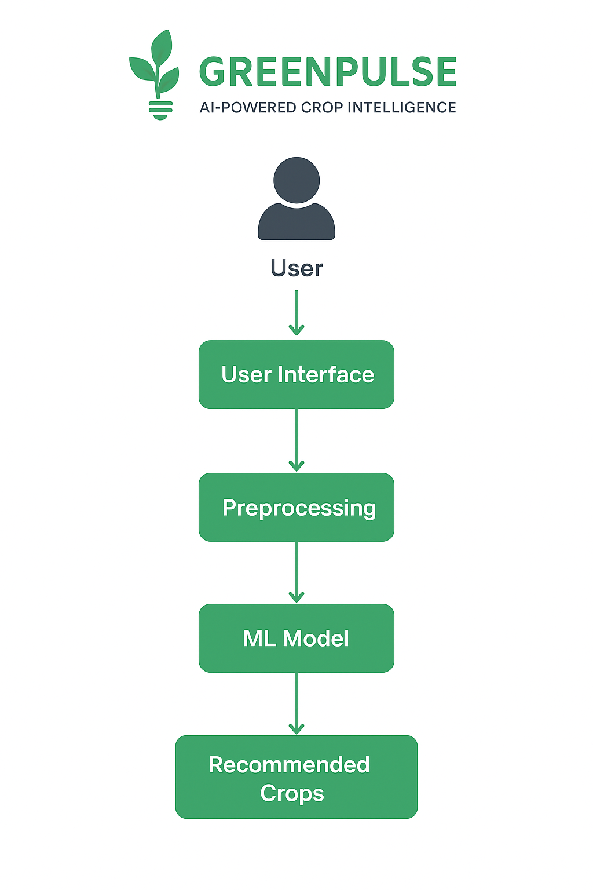

# 🌱 GreenPulse – AI-Powered Smart Crop Recommendation System  

<p align="center">
  
</p>
  

<p align="center">
   
   
   
   
</p>  

---

## 🚀 About the Project  
🌱 **GreenPulse** is a globally-minded yet locally relevant AI-powered agriculture assistant that recommends the most suitable crops for farmers based on **soil nutrients, rainfall, humidity, and climate conditions**.  

> 🌍 *Blending global AI innovation with desi agricultural wisdom to empower farmers with smarter decisions.*  

---

## ✨ Features  
- 🌾 **Smart Crop Prediction** – Based on soil (N, P, K), pH, climate & rainfall  
- 🤖 **AI Model** – Random Forest Classifier with 95% accuracy  
- 🎨 **Interactive Dashboard** – Streamlit-powered farmer-friendly UI  
- 📊 **Evaluation Metrics** – Accuracy score + confusion matrix  
- 🌍 **Global Vision, Local Touch** – Designed for scalability across regions with farmer-first approach  

---

## 🎥 Demo Preview  
<p align="center">
    
   
</p>  

🔗 **[👉 Live Demo Here](https://your-deployed-link-here)**  

---

## 🏗️ System Architecture  
<p align="center">
   
</p>  

---

## ⚙️ Tech Stack  
<p align="center">
   
   <!--  -->
   
</p>

 

- 🐍 **Python 3.x** – Core development  
- 📊 **scikit-learn** – ML model (Random Forest)  
- 🎨 **Streamlit** – User Interface  
- 🧮 **pandas & numpy** – Data handling  
- 📈 **matplotlib, seaborn** – Visualizations  
- ☁️ **Streamlit Cloud / Render** – Deployment  

---

## 🛠️ Installation & Setup  

```bash
# Clone the repo
git clone https://github.com/GuptaMohit-01/GreenPulse.git
cd GreenPulse

# Create a virtual environment
python -m venv env
source env/bin/activate   # Windows: env\Scripts\activate

# Install dependencies
pip install -r requirements.txt

# Train the ML model
python train_model.py

# Run the app
streamlit run app.py
```

🌐 App will open at: `http://localhost:8501`  

---

## 📊 Evaluation  
📌 Model Results:  
- ✅ Accuracy: **95%**  
- 📈 Algorithm: **Random Forest Classifier**  
- 📉 Compared with: Decision Tree, SVM  

<p align="center">
   
</p>  

---

## 💡 Business Impact  
- 👨‍🌾 Helps farmers choose crops that increase yield  
- 📱 Can be integrated into agri-tech apps (Kisan apps, FPO platforms)  
- 🏭 Boosts efficiency for agri-business startups  
- 🌍 Designed for global scalability with desi-first customization  
- 💰 Investor-friendly solution → SaaS-based farmer advisory  

---

## 🔮 Future Enhancements  
- 🌦️ **Weather API Integration** → Real-time recommendation  
- 🧪 **Fertilizer Suggestions** → Soil + Crop-specific  
- 📱 **Mobile App Version** → Farmer-friendly usage  
- 🪄 **Explainable AI (SHAP)** → Why a crop was recommended  
- 🌐 **Multilingual Support** → Local language advisory  

---

## 📂 Project Structure  
```
├── README.md
├── data/
│   └── crop_data.csv
├── train_model.py
├── app.py
├── model.pkl
├── requirements.txt
├── evaluation.png
└── docs/
    ├── architecture.png
    ├── banner.png
    ├── demo1.png
    └── demo2.png
```

---

## 📝 License  
📄 MIT License © 2025 Mohit Kumar  

---

## 🙏 Acknowledgments  
- 🌾 Kaggle Crop Recommendation Dataset  
- 📘 IIT Minor in AI – Module E  
- 🤝 Tools used: ChatGPT, Cursor AI, Streamlit  

---
