<h1 align="center">🌱 GreenPulse Ai</h1>
<h3 align="center">Empowering Farmers with Smart AI Crop Recommendations</h3>

<p align="center">
  
</p>
  

<p align="center">
   
   
   
   
</p>

---
## 📑 Table of Contents
- [About](#-about-the-project)
- [Features](#-features)
- [Demo Preview](#-demo-preview)
- [Screenshots Preview](#-features-preview)
- [System Architecture](#️-system-architecture)
- [Tech Stack](#️-tech-stack)
- [Installation](#️-installation--setup)
- [Usage](#️-installation--setup)   <!-- Usage same section me hai -->
- [Project Structure](#-project-structure)
- [Evaluation](#-evaluation)
- [Roadmap / Future Enhancements](#-roadmap--future-enhancements)
- [Business Impact](#-business-impact)
- [Contributing](#-contributing)
- [License](#-license)
- [Acknowledgments](#-acknowledgments)
- [Author](#-author)

---

## 🚀 About the Project  
🌱 **GreenPulse Ai** is a globally-minded yet locally relevant AI-powered agriculture assistant that recommends the most suitable crops for farmers based on **soil nutrients, rainfall, humidity, and climate conditions**.  

> 🌍 *Blending global AI innovation with desi agricultural wisdom to empower farmers with smarter decisions.*  

---

## ✨ Features  
- 🌾 **Smart Crop Prediction** – Based on soil (N, P, K), pH, climate & rainfall  
- 🤖 **AI Model** – Random Forest Classifier with 95% accuracy  
- 🎨 **Interactive Dashboard** – Streamlit-powered farmer-friendly UI  
- 📊 **Evaluation Metrics** – Accuracy score + confusion matrix  
- 🌍 **Global Vision, Local Touch** – Designed for scalability across regions with farmer-first approach
✅ AI-driven recommendations using ML algorithms  
✅ User-friendly interface built with **Streamlit**  
✅ Real-time insights for farmers & agritech startups  
✅ Scalable architecture for integration with IoT & weather APIs    

---

## 🎥 Demo Preview  
<p align="center">
    
   
</p>  

🔗 **[👉 Live Demo Here](https://your-deployed-link-here)**  

---
## 📸 Screenshots / Feature Preview

Below are some key highlights and features of **GreenPulse**:

<p align="center">
  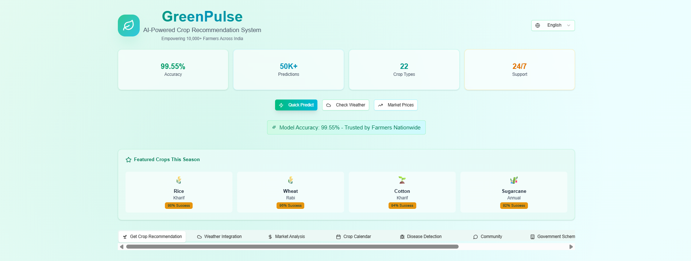
  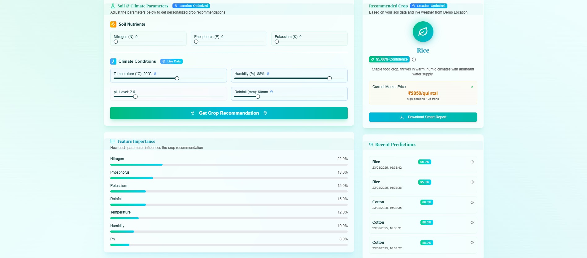
</p>

<p align="center">
  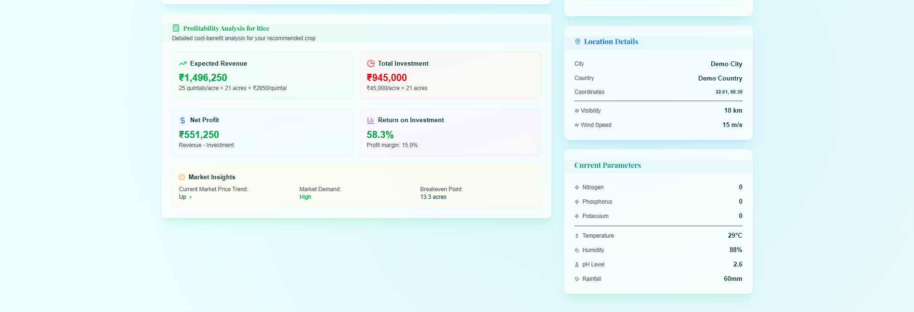
  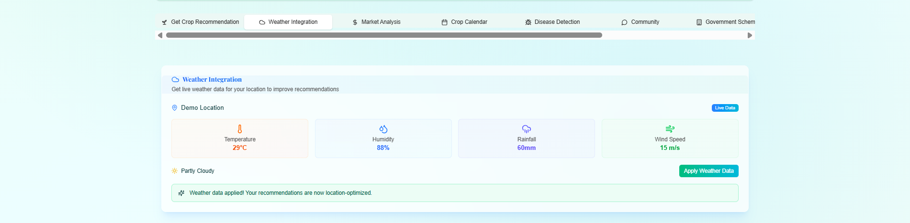
</p>

<p align="center">
  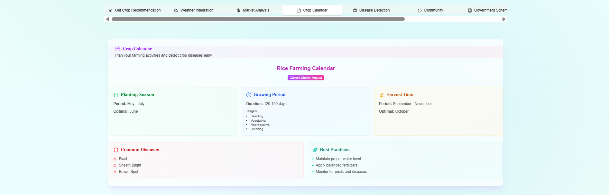
  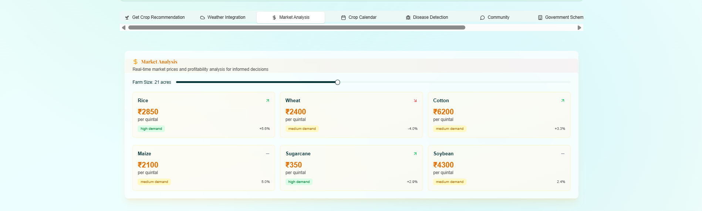
</p>

<p align="center">
  
  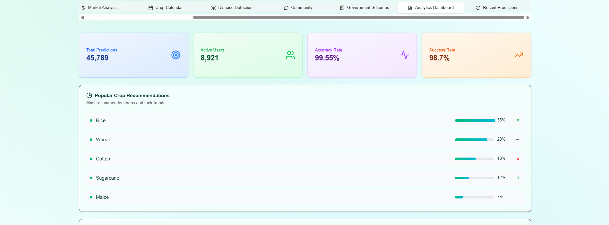
</p>

<p align="center">
  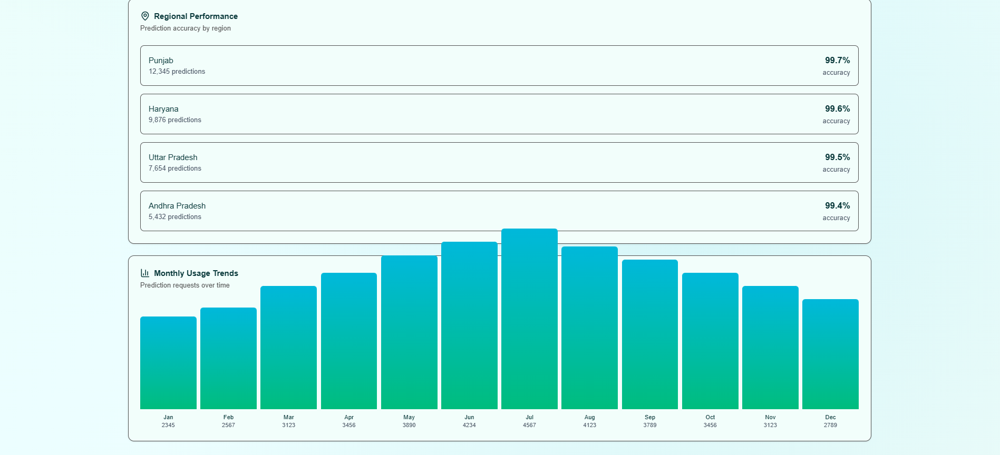
  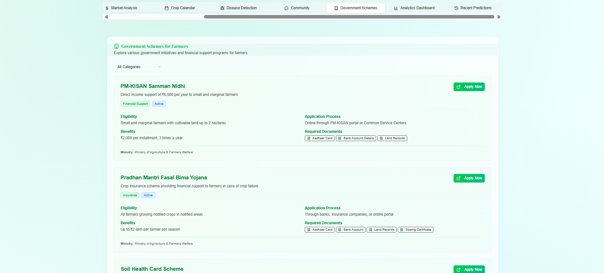
</p>

<p align="center">
  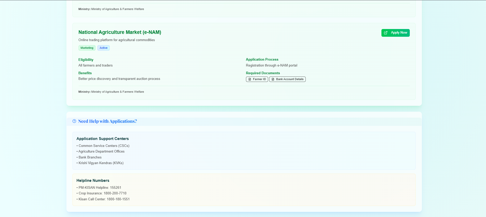
  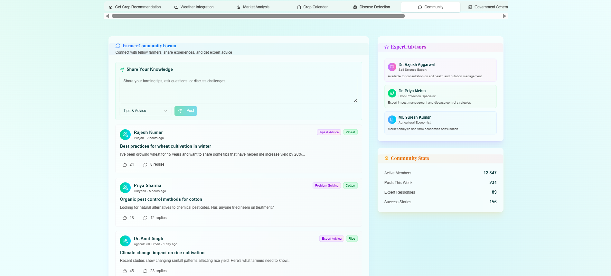
</p>

<p align="center">
  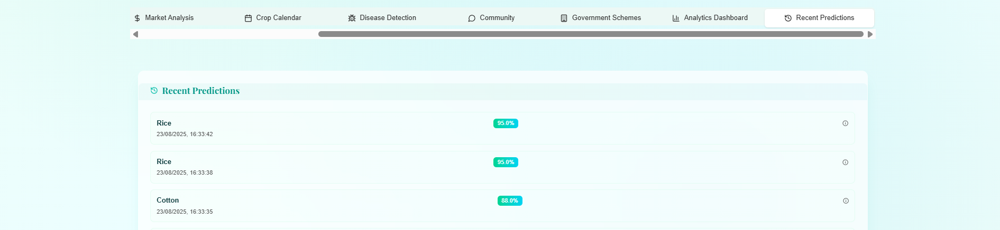
</p>

## 🏗️ System Architecture  
<p align="center">
   
</p>  

---

## ⚙️ Tech Stack  
<p align="center">
   
   <!--  -->
   
</p>

 

- 🐍 **Python 3.x** – Core development  
- 📊 **scikit-learn** – ML model (Random Forest)  
- 🎨 **Streamlit** – User Interface  
- 🧮 **pandas & numpy** – Data handling  
- 📈 **matplotlib, seaborn** – Visualizations  
- ☁️ **Streamlit Cloud / Render** – Deployment  

---

## 🛠️ Installation & Setup  

```bash
# Clone the repo
git clone https://github.com/GuptaMohit-01/GreenPulse.git
cd GreenPulse

# Create a virtual environment
python -m venv env
source env/bin/activate   # Windows: env\Scripts\activate

# Install dependencies
pip install -r requirements.txt

# Train the ML model
python train_model.py

▶️ Usage
# Run the app
streamlit run app.py
```

🌐 App will open at: `http://localhost:8501`  

---

## 📂 Project Structure

<pre>
GreenPulse/
│── app.py                       # Main application (Streamlit/Python)
│── model.pkl                    # Trained ML model
│── requirements.txt             # Python dependencies
│── package.json                  # Node.js/Next.js dependencies
│── next.config.mjs               # Next.js config
│── tsconfig.json                 # TypeScript config
│── README.md                     # Documentation
│── LICENSE                       # License file (MIT)
│── .gitignore                    # Git ignore rules

├── docs/                         # Documentation assets
│   ├── GreenPulse.png            # Logo
│   ├── Sys_Archi.png             # System architecture diagram
│   └── evaluation.png            # Model evaluation chart

├── screenshots/                  # Feature preview images
│   ├── homepage1.png
│   ├── homepage2.png
│   ├── recommendation.png
│   ├── weather.png
│   ├── crop_calendar.png
│   ├── market_analysis.png
│   ├── crop_disease_detection.png
│   ├── analytical_dashboard.png
│   ├── trends.png
│   ├── government_schemes.png
│   ├── gov_sch2.png
│   ├── community.png
│   └── recent_prediction.png

├── components/                   # React/Next.js components (if any)
├── pages/                        # Next.js pages
├── public/                       # Static assets
├── styles/                       # CSS/Tailwind/PostCSS files
├── data/                         # Dataset (optional)
│   └── crop_recommendation.csv
└── notebooks/                    # Experiments (optional)
    └── model_training.ipynb
</pre>

---


## 📊 Evaluation  
<p>We tested multiple ML models on the Kaggle Crop Recommendation Dataset.</p>
📌 Model Results:  
- ✅ Accuracy: **99.55%**  
- 📈 Algorithm: **Random Forest Classifier**  
- 📉 Compared with: Decision Tree, SVM  

<p align="center">
   
</p>  

---

## 🚀 Roadmap / Future Enhancements

- [x] Crop Recommendation using ML 🌱  
- [ ] Weather API Integration ⛅  
- [ ] IoT Sensor Data Support 🌾  
- [ ] Mobile App Interface 📱  
- [ ] Multilingual Farmer Support 🌍 
- [ ] Explainable AI (Model Interpretability) 📊  
- [ ] Integration with Government Schemes & Subsidy Info 🇮🇳  


---

## 💡 Business Impact  
- 👨‍🌾 Helps farmers choose crops that increase yield  
- 📱 Can be integrated into agri-tech apps (Kisan apps, FPO platforms)  
- 🏭 Boosts efficiency for agri-business startups  
- 🌍 Designed for global scalability with desi-first customization  
- 💰 Investor-friendly solution → SaaS-based farmer advisory  

---
## 🤝 Contributing
We welcome contributions!  

- Fork the repo 🍴 
- Create your feature branch 🌿  
- Submit a PR 🚀  

Found a bug? Raise an [Issue here](https://github.com/GuptaMohit-01/GreenPulse/issues).

---

## 🚀Deployment Badge

[](YOUR_DEPLOYED_URL)


## 📝 License  
📄 MIT License © 2025 Mohit Kumar  


---

## 🙏 Acknowledgments  
- 🌾 Kaggle Crop Recommendation Dataset  
- 📘 IIT Minor in AI – Module E  
- 🤝 Tools used: ChatGPT, Cursor AI, Streamlit  

---

## 👨‍💻 Author
**Mohit Kumar**  
- 📧 Email: guptamohitlife01@gmail.com  
- 🔗 [LinkedIn](https://www.linkedin.com/in/mohit-kumar-0aa866328/)  
- 🐙 [GitHub](https://github.com/GuptaMohit-01)
